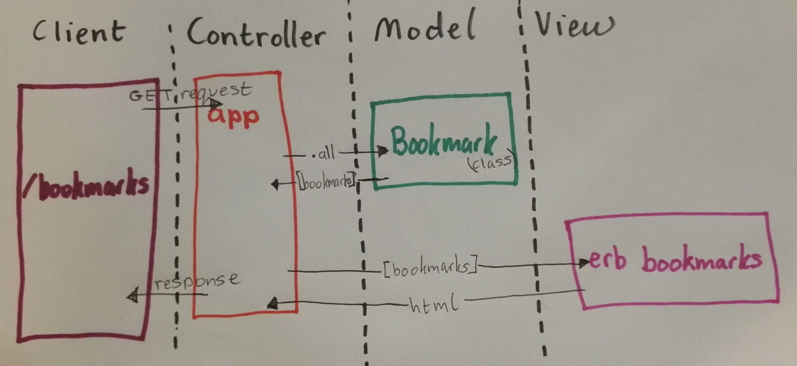

# Bookmark Manager

### Requirement 1: show a list of bookmarks

  User Story 1

As someone who is very busy
So that I can revisit my favourite webpages
I want to see a list of all my bookmarks

  Domain Model 1
  
Nouns: busy person, favourite webpages, list of bookmarks
Verbs: revisit, see



### To set up the project
Clone this repository and then run:

```
bundle
```

### To set up the database

Connect to `psql` and create the `bookmark_manager` database:

```
CREATE DATABASE bookmark_manager;
```

To set up the appropriate tables, connect to the database in `psql` and run the SQL scripts in the `db/migrations` folder in the given order.

### To run the Bookmark Manager app:

```
rackup -p 4567

To view bookmarks, navigate to `localhost:4567/bookmarks`.